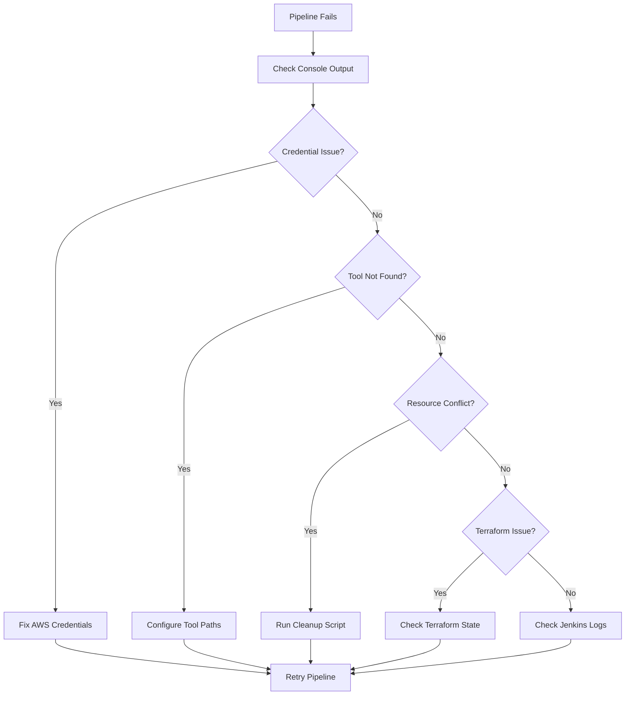

# Jenkins Pipeline Setup Guide

This guide will help you set up and troubleshoot your Jenkins pipeline for the Redis infrastructure project.

## 🚀 Quick Fix Steps

### 1. Replace Your Current Jenkinsfile

Replace your current `Jenkinsfile` with `Jenkinsfile_Fixed` which includes:
- Better error handling
- Improved credential management
- Enhanced logging and debugging
- Proper tool path configuration
- Comprehensive verification steps

```bash
# Backup current Jenkinsfile
mv Jenkinsfile Jenkinsfile_backup

# Use the fixed version
mv Jenkinsfile_Fixed Jenkinsfile
```

### 2. Run Troubleshooting Script

```bash
# Make the script executable
chmod +x jenkins-troubleshoot.sh

# Run the troubleshooting script
./jenkins-troubleshoot.sh
```

## 🔧 Jenkins Configuration Requirements

### Required Jenkins Plugins

Install these plugins in Jenkins:
- **Git Plugin** - For repository management
- **Pipeline Plugin** - For pipeline support
- **AWS CLI Plugin** - For AWS integration
- **Credentials Plugin** - For secure credential storage
- **Blue Ocean Plugin** - For enhanced pipeline visualization

### AWS Credentials Setup

1. **Go to Jenkins Dashboard**
2. **Navigate to:** Manage Jenkins → Credentials → System → Global credentials
3. **Add Credentials:**

   **Credential 1:**
   - Kind: `Secret text`
   - Secret: `Your AWS Access Key ID`
   - ID: `AWS_ACCESS_KEY_ID`
   - Description: `AWS Access Key ID`

   **Credential 2:**
   - Kind: `Secret text`
   - Secret: `Your AWS Secret Access Key`
   - ID: `AWS_SECRET_ACCESS_KEY`
   - Description: `AWS Secret Access Key`

### Tool Configuration

1. **Go to:** Manage Jenkins → Global Tool Configuration
2. **Configure the following tools:**

   **Terraform:**
   - Name: `terraform`
   - Install automatically: ✅
   - Version: Latest

   **AWS CLI:**
   - Name: `aws-cli`
   - Install automatically: ✅

   **Ansible:**
   - Name: `ansible`
   - Install automatically: ✅

## 🐛 Common Issues and Solutions

### Issue 1: "Tool not found" errors

**Problem:** Jenkins can't find terraform, aws, or ansible commands

**Solution:**
```groovy
// Add this to your pipeline environment section
environment {
    PATH = "/usr/local/bin:/opt/homebrew/bin:${env.PATH}"
    // ... other environment variables
}
```

### Issue 2: AWS Credentials not working

**Problem:** AWS authentication fails

**Solutions:**
1. **Verify credentials in Jenkins:**
   ```bash
   # Test in Jenkins pipeline
   withCredentials([...]) {
       sh 'aws sts get-caller-identity'
   }
   ```

2. **Check credential IDs match exactly:**
   - `AWS_ACCESS_KEY_ID`
   - `AWS_SECRET_ACCESS_KEY`

### Issue 3: Terraform state conflicts

**Problem:** Terraform state is locked or corrupted

**Solutions:**
```bash
# Force unlock (use carefully)
cd terraform
terraform force-unlock <LOCK_ID>

# Or remove state and start fresh
rm terraform.tfstate*
terraform init
```

### Issue 4: AWS Service Limits

**Problem:** VPC limit exceeded, Elastic IP limit exceeded

**Solutions:**
```bash
# Clean up unused resources
./quick-cleanup.sh

# Or manual cleanup
aws ec2 describe-vpcs --query 'Vpcs[?Tags[0].Value!=`default`]'
aws ec2 delete-vpc --vpc-id <VPC_ID>
```

### Issue 5: Key Pair Issues

**Problem:** Key pair already exists or permission denied

**Solutions:**
1. **Use existing key pair:**
   - Set `recreateKeyPair` parameter to `false`
   - Manually upload your .pem file to Jenkins

2. **Force recreate:**
   - Set `recreateKeyPair` parameter to `true`
   - Pipeline will delete and recreate the key pair

## 📋 Pipeline Parameters Explained

| Parameter | Default | Description |
|-----------|---------|-------------|
| `autoApprove` | `true` | Skip manual approval for terraform apply |
| `action` | `apply` | Choose between `apply` or `destroy` |
| `keyPairName` | `redis-infra-key` | AWS key pair name to use |
| `recreateKeyPair` | `false` | Force recreate key pair if exists |
| `skipAnsible` | `false` | Skip Ansible configuration step |

## 🔍 Debugging Pipeline Issues

### Enable Debug Logging

Add this to your pipeline:
```groovy
environment {
    TF_LOG = 'DEBUG'
    ANSIBLE_DEBUG = '1'
}
```

### Check Jenkins Logs

1. **Pipeline Console Output:** Click on build number → Console Output
2. **Jenkins System Logs:** Manage Jenkins → System Log
3. **Blue Ocean View:** Open Blue Ocean → Select pipeline → View logs

### Manual Testing Commands

Test components individually:
```bash
# Test AWS connectivity
aws sts get-caller-identity

# Test Terraform
cd terraform
terraform init
terraform plan

# Test Ansible
ansible --version
ansible-playbook --syntax-check playbook.yml
```

## 🚀 Step-by-Step Pipeline Execution

### 1. Pre-Pipeline Checklist
- [ ] AWS credentials configured in Jenkins
- [ ] Required plugins installed
- [ ] Tools configured (terraform, aws-cli, ansible)
- [ ] Repository accessible from Jenkins
- [ ] AWS service limits sufficient

### 2. Pipeline Stages Explained

1. **Environment Setup** - Validates tools and parameters
2. **Clone Repository** - Checks out latest code
3. **AWS Credentials Check** - Verifies AWS access
4. **Key Pair Management** - Creates/manages SSH key pairs
5. **Terraform Initialize** - Initializes Terraform
6. **Terraform Plan** - Creates execution plan
7. **Terraform Execute** - Applies or destroys infrastructure
8. **Infrastructure Verification** - Validates deployment

### 3. Post-Pipeline Actions

After successful deployment:
1. **Download artifacts:**
   - `redis-infra-key.pem` - SSH key for server access
   - `terraform-outputs.json` - Infrastructure details
   - `pipeline-summary.txt` - Deployment summary

2. **Connect to infrastructure:**
   ```bash
   # Connect to bastion host
   ssh -i redis-infra-key.pem ubuntu@<PUBLIC_IP>
   
   # Connect to Redis nodes via bastion
   ssh -i redis-infra-key.pem -J ubuntu@<BASTION_IP> ubuntu@<REDIS_NODE_IP>
   ```

## 🔄 Pipeline Troubleshooting Workflow



## 📞 Getting Help

If you're still experiencing issues:

1. **Run the troubleshooting script:**
   ```bash
   ./jenkins-troubleshoot.sh
   ```

2. **Check the specific error message** in Jenkins console output

3. **Common error patterns:**
   - `command not found` → Tool path issue
   - `Access Denied` → Credential issue
   - `already exists` → Resource conflict
   - `limit exceeded` → AWS service limits

4. **Collect diagnostic information:**
   ```bash
   # System info
   jenkins --version
   terraform version
   aws --version
   ansible --version
   
   # AWS info
   aws sts get-caller-identity
   aws ec2 describe-vpcs --region ap-south-1
   ```

## ✅ Success Indicators

Your pipeline is working correctly when you see:
- ✅ All stages complete successfully
- ✅ 4 EC2 instances running (1 bastion + 3 Redis nodes)
- ✅ VPC and networking components created
- ✅ Security groups configured properly
- ✅ Terraform outputs generated
- ✅ SSH key pair available for download

---

**Remember:** Always test your pipeline with a small deployment first, and keep backups of your Terraform state files!
